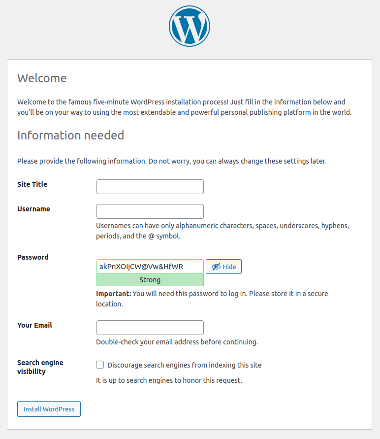

# WordPress HA Cluster Setup/Automation

### Overview
---
+ This GitLab project automates the setup and deployment of a redundant WordPress cluster using Terraform and Ansible on Hetzner Cloud. 
+ The project ensures high availability and reliability by setting up a Percona XtraDB Cluster on all four servers for the database layer and a on LB server the WordPress application.
+ The load balancer handles SSL termination, and the service can be accessed through the URL https://your-domain.com.
+ The project is designed to provide clear documentation and a modular structure, making it easy for DevOps engineers familiar with Terraform and Ansible to understand, deploy, and manage the WordPress cluster.

---

### How does it look?
---

+ After deploying and configuring everything, you should land on this page
+ by visiting your domain under _https://your-domain.com_

+ Just create your Title, Username and Password and you are ready to go.

---
### Key Features and Technologies
---

+ **Redundant Database Cluster**: The project leverages Percona XtraDB Cluster to set up a redundant and highly available database layer across four servers. This ensures data availability even in the event of server failures.

+ **WordPress Application Server**: The WordPress application is deployed to LB host. This setup with four database replication, ensure redundancy and HA, enhancing the overall performance and manageability of the cluster.

+ **Load Balancer and SSL Termination**: The load balancer plays a crucial role in distributing incoming traffic to the application servers. It also handles SSL termination, ensuring secure communication between users and the cluster.

+ **Modular IAC Structure**: The IAC (Infrastructure as Code) components, including Terraform and Ansible scripts, are structured in a modular manner. Each component is isolated and organized, making it easier to manage and maintain specific parts of the infrastructure.

Infrastructure Deployment [Terraform]:

* The project uses Terraform to provision infrastructure, creating redundant instances of WordPress with a load balancer and a database server. 
* To get started, create your variables.tf file in the main directory and add your  Hetzner Cloud API key for the setup:

variable "hcloud_token" {
  description = "Hetzner Cloud API Key"
  default     = "your-hetzner-api-key"
}

* A reusable Terraform module named servers-hetzner is defined, ensuring consistency and modularity in the infrastructure setup.
* The load balancer is set up with SSL termination using a previous generated Let's Encrypt certificate, enhancing security and providing a seamless user experience.
(you can generate your certificate with certbot in a few simple steps)
* _Make SURE to copy your certificate and private key inside the modules/hetzner-server/certs directory._

Configuration Management [Ansible]:

* Ansible is employed for configuring the WordPress instances and the database server. The configuration is organized into separate roles, enhancing maintainability and modularity.
* The master playbook define the necessary tasks to set up PHP, WordPress, and the database servers.
* Variables and templates are used to customize configurations, ensuring flexibility and easy adaptation to different environments.

---
### Usage
---

To deploy the WordPress cluster, follow these steps:

+ Generate an SSH key to access the servers. In this example hcloud-key name is used. Modify the code in modules/servers-hetzner/main.tf accordingly to match your SSH Key(s). You can generate your key with with:
&nbsp;_ssh-keygen -f ~/.ssh/key-name -t rsa -b 4096 -N ''_

+ In my deployment I will upload 2 SSH public keys on the servers.

+ Clone the Repository: Clone this GitLab repository to your local machine.

+ Configure Terraform: Navigate to the wordpress-cluster directory. In variables.tf, set any required variables like API keys or configuration parameters.

+ Add your SSL Certificates in modules/servers-hetzner/certs dir (create the dir)

+ Provision Infrastructure: Execute Terraform commands to provision the infrastructure:

&nbsp;&nbsp;&nbsp;&nbsp;_terraform init_
&nbsp;&nbsp;&nbsp;&nbsp; _terraform plan_
&nbsp;&nbsp;&nbsp;&nbsp; _terraform apply_

+ Run the _inventory.sh_ script, to generate the IP inventory for Ansible.

+ Configure Ansible: Customize the Ansible roles and tasks in the ansible-config directory to match your environment requirements.

+ Run Ansible Playbooks: Execute Ansible playbooks to configure the instances:

ansible-playbook -i inventory -u root _master.yaml

+ Access the Service: Once deployed, the WordPress cluster can be accessed via https://your-domain.com.

---
### POST INSTALL CHECKS:
---
- show status like '%wsrep%';  -> check on LB to see the cluster_size: 4
- make a post on wordpress. ssh into a web server (ex.: web3) and check:
- use wp_cluster; select * from wp_posts; -> the post should be there as well.

---
### Security and Future Improvements
---
On the security side, there is room for improvement. However, this project serves as a demonstration and template to showcase the setup and automation of a WordPress cluster. Future iterations can focus on enhancing security measures and implementing best practices to ensure a robust and secure deployment.

Customization and Contributions: Feel free to explore and modify the project to suit your needs. Contributions are welcome through pull requests.

---
### Runners (pipelines to be implemented)
---
+ This project utilizes self-managed runners on a dedicated virtual machine to execute pipelines. Self-managed runners offer control over the environment, allowing customization and optimal performance.

To set up self-managed runners, follow these steps:

+ Provision a virtual machine with suitable specifications.
+ Install and configure GitLab Runner software as per the official documentation.
+ Register the runner with your GitLab instance using the provided registration token.
+ Self-managed runners provide flexibility and resource control for your CI/CD workflows. For more details, refer to the GitLab Runner documentation.

### License
This project is licensed under the MIT License. Please see the LICENSE file for more details.

Your contributions and suggestions are valuable in enhancing this automation solution. Let's collaborate and make managing WordPress clusters easier together!